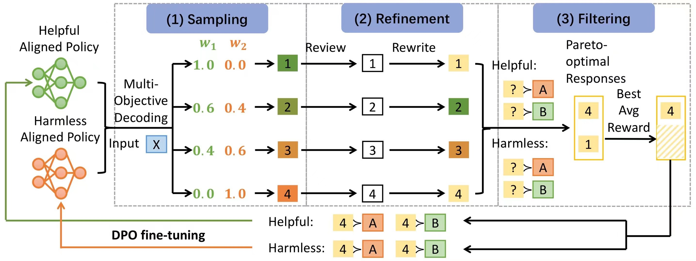

# SIPO: Self-Improvement Towards Pareto Optimality

Official code for paper "Self-Improvement Towards Pareto Optimality: Mitigating Preference Conflicts in Multi-Objective Alignment"

<p align="center">
  
</p>

We provide instructions for running SIPO with MOD sampling on the **HelpSteer** dataset. For the **BeaverTails-10K** subset, please refer to [scripts/examples/beavertails.sh](scripts/examples/beavertails.sh).

## Environment Set Up
```
conda create -n SIPO python=3.10.15
pip install -r requirements.txt
```
## Dataset Preprocess
```
python ./src/data/preprocess/HS_preprocess.py --tokenizer_path PKU-Alignment/alpaca-7b-reproduced
```
## SFT
We follow the code of [modpo](https://github.com/ZHZisZZ/modpo) to perform SFT on llama-2-7b. See the repository and [scripts/sft](scripts/sft) for more details.

## First Time alignment
1. Perform first time alignment on the sft-model using DPO on two conflicted objectives (*correctness* and *verbosity* for **HelpSteer**). 
```
CUDA_VISIBLE_DEVICES=0 PYTHONPATH=. python scripts/baselines/dpo.py     --sft_model_name {path_to_the_sft_model}     --prompt_template "BEGINNING OF CONVERSATION: USER: {raw_prompt} ASSISTANT:"     --dataset_name "nvidia/HelpSteer-pairwise-{correctness|verbosity}-0.6"     --max_length 512     --training_args.output_dir "./output/nvidia/HelpSteer/SIPO/{1.0|0.0}correctness"     --training_args.run_name "nvidia/HelpSteer/SIPO/{1.0|0.0}correctness"     --training_args.per_device_train_batch_size 1     --training_args.per_device_eval_batch_size 6     --training_args.gradient_accumulation_steps 2     --training_args.learning_rate 5e-4     --peft_config.r 64     --peft_config.target_modules q_proj k_proj v_proj o_proj     --peft_config.lora_alpha 1     --peft_config.lora_dropout 0
```

## MOD sampling
2. Use MOD sampling to sample responses.
```
accelerate launch scripts/baselines/mod.py     --soup_weights 0.2 0.4 0.6 0.8   --sft_model_name {path_to_the_sft_model}    --dpo_model_1_name "./output/nvidia/HelpSteer/SIPO/0.0correctness/best_checkpoint"    --dpo_model_2_name "./output/nvidia/HelpSteer/SIPO/1.0correctness/best_checkpoint"     --prompt_template "BEGINNING OF CONVERSATION: USER: {raw_prompt} ASSISTANT:"     --dataset_name "nvidia/HelpSteer-pairwise-correctness-0.6"     --output_dir "./output/nvidia/HelpSteer/SIPO/gen_sample"     --max_length 512  --eval_size -1  --split "train_conflict"
```

## Review Generation
3. Generate reviews for the MOD-sampled responses.
```
CUDA_VISIBLE_DEVICES=0 PYTHONPATH=. python ./scripts/SIPO/review.py --sft_model_name {path_to_the_sft_model} --adapter_model_name "./output/nvidia/HelpSteer/SIPO/1.0correctness/best_checkpoint" --prompt_template "BEGINNING OF CONVERSATION: USER: {raw_prompt} ASSISTANT:" --input_dir "./output/nvidia/HelpSteer/SIPO/gen_sample" --output_dir "./output/nvidia/HelpSteer/SIPO/review" --max_length 1200 --replication 4
```

## Rewrite
4. Rewrite MOD_sampled response based on the reviews.
```
PYTHONPATH=. accelerate launch ./scripts/SIPO/rewrite.py --sft_model_name {path_to_the_sft_model}     --dpo_model_1_name "./output/nvidia/HelpSteer/SIPO/0.0correctness/best_checkpoint"   --dpo_model_2_name "./output/nvidia/HelpSteer/SIPO/1.0correctness/best_checkpoint"    --prompt_template "BEGINNING OF CONVERSATION: USER: {raw_prompt} ASSISTANT:"    --input_dir "./output/nvidia/HelpSteer/SIPO/review"   --output_dir "./output/nvidia/HelpSteer/SIPO/rewrite"    --max_length 1600
```

## Filter
5. Combine rewritten responses that are no worse than MOD-sampled responses. Filter the combined responses using weight-interpolated models.
### combine rewritten responses
```
CUDA_VISIBLE_DEVICES=0 PYTHONPATH=. python3 scripts/SIPO/select_rewrite.py    --sft_model_name {path_to_the_sft_model}    --adapter_model_name "./output/nvidia/HelpSteer/SIPO/0.0correctness/best_checkpoint , ./output/nvidia/HelpSteer/SIPO/1.0correctness/best_checkpoint"    --prompt_template "BEGINNING OF CONVERSATION: USER: {raw_prompt} ASSISTANT:"    --input_mod_dir "./output/nvidia/HelpSteer/SIPO/gen_sample"  --input_dir "./output/nvidia/HelpSteer/SIPO/rewrite"    --output_dir "./output/nvidia/HelpSteer/SIPO/combine"    --replication 4    --eval_size 582    --peft_config.r 64     --peft_config.target_modules q_proj k_proj v_proj o_proj     --peft_config.lora_alpha 1     --peft_config.lora_dropout 0
```
### filter combined responses
```
CUDA_VISIBLE_DEVICES=0 PYTHONPATH=. python3 scripts/SIPO/select_sample.py    --soup_weights 0.2 0.4 0.6 0.8    --sft_model_name {path_to_the_sft_model}    --adapter_model_name "./output/nvidia/HelpSteer/SIPO/0.0correctness/best_checkpoint , ./output/nvidia/HelpSteer/SIPO/1.0correctness/best_checkpoint"   --prompt_template "BEGINNING OF CONVERSATION: USER: {raw_prompt} ASSISTANT:"    --dataset_name "nvidia/HelpSteer-pairwise-correctness-0.6"    --input_dir "./output/nvidia/HelpSteer/SIPO/combine"    --output_dir "./output/nvidia/HelpSteer/SIPO/filter"    --replication 4    --eval_size 582    --peft_config.r 64     --peft_config.target_modules q_proj k_proj v_proj o_proj     --peft_config.lora_alpha 1     --peft_config.lora_dropout 0
```

## Fine-tuning
6. Fine-tune the models obtained in the initial alignment on filtered responses, using DPO loss with NLL loss regulatization. 
### cache conflicted data locally
```
PYTHONPATH=. python scripts/SIPO/cache_conflict.py --prompt_template "BEGINNING OF CONVERSATION: USER: {raw_prompt} ASSISTANT:" --dataset_name "nvidia/HelpSteer-pairwise-correctness-0.6" --eval_size -1
```
### merge peft adpters to model weights
```
PYTHONPATH=. python src/tools/merge_peft_adapter.py     --adapter_model_name "./output/nvidia/HelpSteer/SIPO/{1.0|0.0}correctness"     --base_model_name {path_to_the_sft_model}     --output_name "/model/HelpSteer_{correct|verbose}_DPO_model"    --dtype bf16
```
### re-alignment
```
CUDA_VISIBLE_DEVICES=0 PYTHONPATH=. python scripts/SIPO/Iterative_DPO.py --sft_model_name "/model/HelpSteer_{correct|verbose}_DPO_model"     --prompt_template "BEGINNING OF CONVERSATION: USER: {raw_prompt} ASSISTANT:"    --cached_data_dir "./output/cached_datasets/nvidia/HelpSteer-pairwise-correctness-0.6"    --dataset_name "./output/nvidia/HelpSteer/SIPO/filter"    --original_dataset_name "nvidia/HelpSteer-pairwise-{correctness|verbosity}-0.6"    --max_length 512    --training_args.output_dir "./output/nvidia/HelpSteer/SIPO/re-alignment/{1.0|0.0}correctness"     --training_args.run_name "nvidia/HelpSteer/SIPO/re-alignment/{1.0|0.0}correctness"     --training_args.per_device_train_batch_size 1     --training_args.per_device_eval_batch_size 6     --training_args.gradient_accumulation_steps 2     --training_args.learning_rate 5e-6     --peft_config.r 64     --peft_config.target_modules q_proj k_proj v_proj o_proj     --peft_config.lora_alpha 1     --peft_config.lora_dropout 0    --alpha 0.1
```

## Evaluation
7. Use the models after re-alignment and MOD sampling to sample responses on test questions. Evaluate the responses using official released reward models.
### MOD sampling on models after re-alignment
```
CUDA_VISIBLE_DEVICES=0 PYTHONPATH=. python3 scripts/utils/mod_general.py     --soup_weights {0.2|0.4|0.6|0.8}   --sft_model_1_name "/model/HelpSteer_correct_DPO_model"    --sft_model_2_name "/model/HelpSteer_verbose_DPO_model"     --dpo_model_1_name "./output/nvidia/HelpSteer/SIPO/re-alignment/1.0correctness/best_checkpoint"    --dpo_model_2_name "./output/nvidia/HelpSteer/SIPO/re-alignment/0.0correctness/best_checkpoint"     --prompt_template "BEGINNING OF CONVERSATION: USER: {raw_prompt} ASSISTANT:"     --dataset_name "nvidia/HelpSteer-pairwise-correctness"     --output_dir "./output/nvidia/HelpSteer/SIPO/re-alignment/{0.2|0.4|0.6|0.8}correctness
/gen_test"     --max_length 512  --eval_size -1  --split "test"
```
### evaluation using official released RMs
```
CUDA_VISIBLE_DEVICES=0 PYTHONPATH=. python3 scripts/utils/HS_score.py  --input_dir "./output/nvidia/HelpSteer/SIPO/re-alignment/{0.2|0.4|0.6|0.8}correctness/gen_test"     --output_dir "./output/nvidia/HelpSteer/SIPO/re-alignment/{0.2|0.4|0.6|0.8}correctness/score"
```
